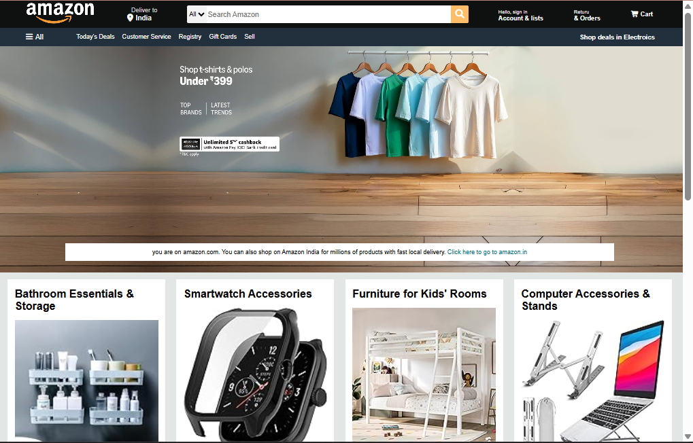
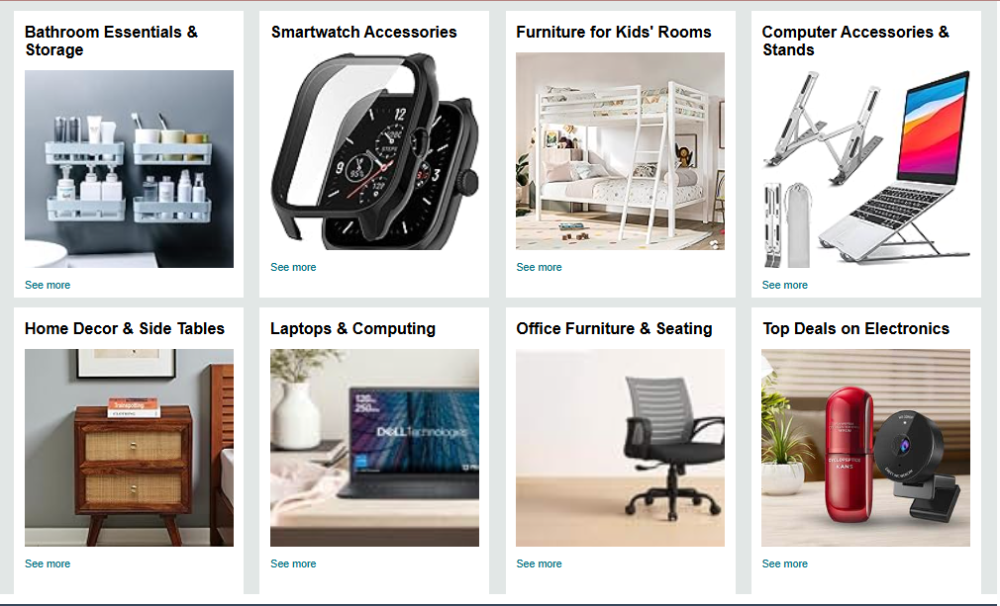
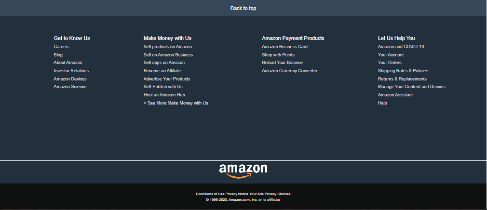

# 🛒 Amazon.in Frontend Landing Page Clone

Welcome to the production-ready frontend replica of the **Amazon.in** home page. This project focuses on absolute pixel-perfect UI engineering, semantic HTML structural design, and responsive CSS styling hierarchies to emulate the exact layout of India's leading e-commerce portal.

This repository demonstrates advanced styling capabilities, grid/flex layouts, custom navigation headers, and structured footers built purely from scratch without external design frameworks.

---

## 🤵 Repository Host Details

- **Author Name:** amir
- **GitHub Profile Alias:** [amirsohail100](https://github.com/amirsohail100)
- **Official Communication Endpoints:** amirsoahil10@gmail.com
- **Project Status:** Frontend Completed 🟢

---

## 🖥️ Graphical User Interface Preview (UI Showcases)

Below is the step-by-step visual breakthrough of the cloned interactive landing page, captured from my local workspace.

### 1. Header & Hero Section (Top View)

<div align="center">
  
  <p><i>Navigation Header Bar, Delivery Matrix, Search Ingestion Engine, and Hero Product Slides</i></p>
</div>

### 2. Product Grid Layouts (Middle View)

<div align="center">
  
  <p><i>Multi-Column Product Grid Cards displaying diverse categorical offers</i></p>
</div>

### 3. Navigation Links & Footer (Bottom View)

<div align="center">
  
  <p><i>Back to Top mechanics and fully semantic structural Directory Links + Bottom Footer</i></p>
</div>

---

## 🛠️ Core Features & Engineering Objectives

- **Semantic HTML5 Backbone:** Built entirely using structural semantic tags like `<header>`, `<nav>`, `<main>`, `<section>`, and `<footer>` for maximum code clarity.
- **Complex Navigation & Layouts:** Leveraged precise styling vectors to mirror the multi-layered Amazon navigation bar, drop-down zones, and sub-header utility bars.
- **Dynamic CSS Grid Systems:** Engineered flexible, scalable grid item rows to adaptively render product category boxes, discount lists, and banner interfaces.
- **Hover State Interaction:** Programmed realistic transitions and visual hover feedback across all main buttons, utility links, and shopping components.

---

## 💻 Tech Stack & UI Components

- **Markup Architecture:** HTML5 Core Structural Layout
- **Styling Framework:** Custom Vanilla CSS3 (Variables, Flexbox, Grid Layouts)
- **Assets Ingestion:** High-Resolution Official Amazon Web Icons & Image Bundles

---

## 🚀 How to Launch the Clone Locally

Follow these basic steps to run and view this front-end landing page instantly on your machine:

### 1. Clone the Workspace Endpoint

```bash
git clone [https://github.com/amirsohail100/Amazon-clone.git](https://github.com/amirsohail100/Amazon-clone.git)
cd Amazon-clone
```
